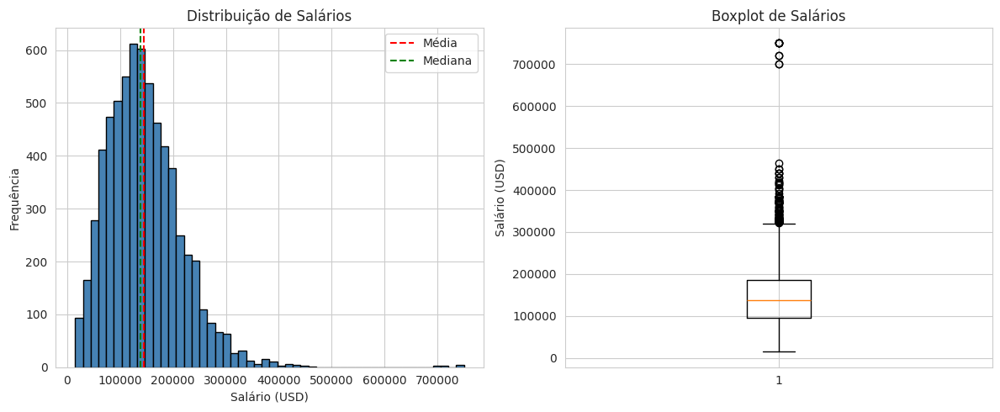
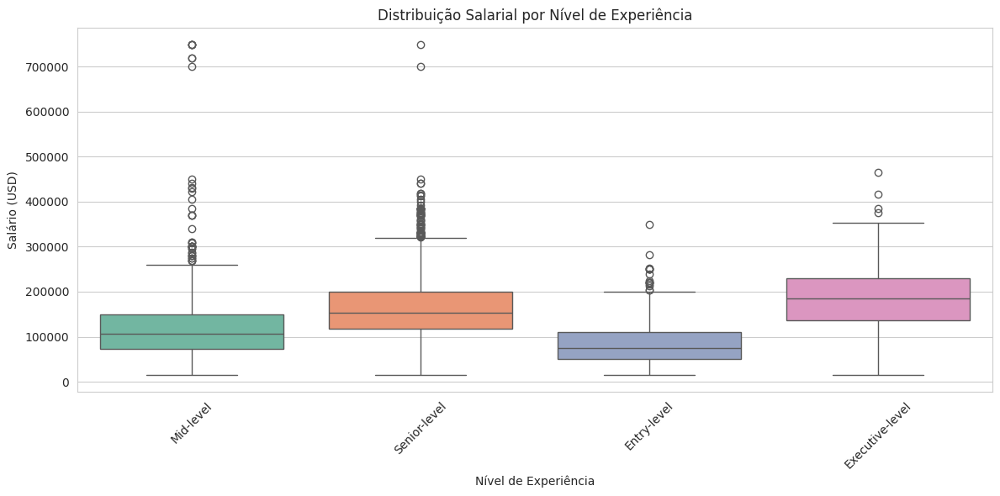
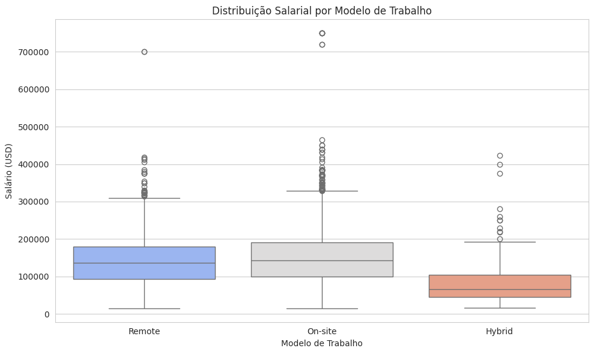
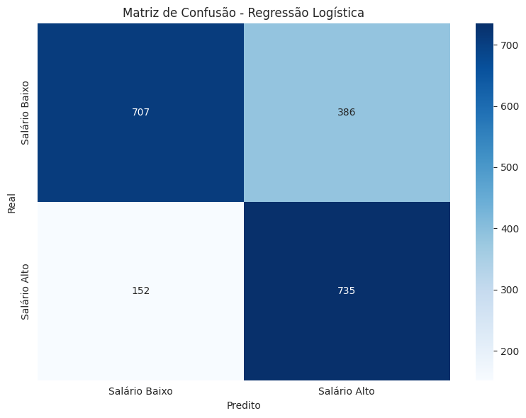

# 📊 Data Science Salary Analysis


Análise exploratória e modelagem preditiva de salários na área de Data Science, desenvolvida para o projeto **Global Solution 2025.2 - FIAP**, seguindo a metodologia OSEMN (Obtain, Scrub, Explore, Model, iNterpret).

---

## 🎯 Objetivo

Investigar os fatores que influenciam a remuneração de profissionais de Ciência de Dados globalmente e construir modelos preditivos para apoiar decisões estratégicas de RH.

---

## 👥 Autores

- **João Victor Soave** - RM557595
- **Guilherme Araujo de Carvalho** - RM558926
- **Maria Alice Freitas Araújo** - RM557516

---

## 📂 Estrutura do Projeto
- `data/`: Dataset (Kaggle - Data Science Job Salaries)
- `notebooks/`: Jupyter Notebooks com análises
- `reports/`: Visualizações e relatórios

---

## 📊 Dataset

**Fonte:** [Kaggle - Data Science Job Salaries](https://www.kaggle.com/datasets/sazidthe1/data-science-salaries)

**Características:**
- **6.599 registros** de profissionais de Data Science
- **11 variáveis:** cargo, experiência, tipo de contrato, modelo de trabalho, ano, localização, salário, moeda, porte da empresa
- **Período:** 2020-2024
- **Cobertura:** 75 países, 132 cargos diferentes

---

## 🔧 Tecnologias Utilizadas

- **Python 3.8+**
- **Pandas** & **NumPy** - Manipulação de dados
- **Matplotlib** & **Seaborn** - Visualizações
- **Scikit-learn** - Machine Learning
- **Statsmodels** - Análise estatística
- **Imbalanced-learn** - Balanceamento de dados (SMOTE)

---

## 📈 Metodologia OSEMN

### 1️⃣ **Obtain** (Obtenção)
- Carregamento do dataset do Kaggle
- 6.599 registros sem valores ausentes

### 2️⃣ **Scrub** (Limpeza)
- Criação da variável target `salario_alto` (acima da média: $145.560)
- Encoding de variáveis categóricas (One-Hot Encoding)
- Balanceamento com SMOTE para regressão logística

### 3️⃣ **Explore** (Exploração)
- **Análise descritiva:** Média, mediana, desvio padrão por grupos
- **Visualizações:** Histogramas, boxplots, gráficos de barras, matriz de correlação
- **Insights principais:**
  - Profissionais Senior-level ganham em média $156k
  - Trabalho presencial tem média $152k vs remoto $140k
  - Full-time paga 181% mais que Freelance

### 4️⃣ **Model** (Modelagem)
**Regressão Linear:**
- R² = 0.39 (39% da variância explicada)
- RMSE = $55.390
- MAE = $39.572

**Regressão Logística:**
- Acurácia = 73%
- AUC-ROC = 0.80
- Precision = 0.75 | Recall = 0.73

### 5️⃣ **iNterpret** (Interpretação)
- Nível de experiência é o principal preditor salarial
- Localização geográfica impacta significativamente
- Modelo logístico eficaz para identificar talentos premium (AUC > 0.8)

---

## 🔍 Principais Descobertas (Salário Anual USD)

### 💰 Estatísticas Gerais
- **Média salarial:** $145.560
- **Mediana:** $138.666
- **Desvio padrão:** $70.946

### 📊 Por Nível de Experiência
| Nível | Média Salarial |
|-------|----------------|
| Executive | $193.722 |
| Senior | $156.255 |
| Mid-level | $108.178 |
| Entry-level | $78.283 |

### 🏢 Por Modelo de Trabalho
- **On-site:** $152.600 (maior média)
- **Remote:** $140.550
- **Hybrid:** $83.293

### 🌍 Top 5 Países (Média Salarial Anual)
1. Qatar
2. Israel
3. United States
4. Canada
5. Switzerland

---

## 📸 Visualizações

1. **Métricas Descritivas de Salário**
  
   - Histograma + Boxplot de salários
   - Captura: Seção 3.1 do notebook

2. **Análise por Nível de Experiência`**
   
   - Boxplot por nível de experiência
   - Captura: Seção 3.2

3. **Correlação entre Work Models (Remoto) e Salário**
   
   - Comparação On-site vs Remote vs Hybrid
   - Captura: Seção 3.7

4. **Matriz de Confusão - Regressão Logística**
   
   - Matriz de confusão do modelo logístico
   - Captura: Seção 4.3

5. **Curva ROC - Regressão Logística**
    
   - Curva ROC (AUC = 0.80)
   - Captura: Final da seção 4.3

---

## 🚀 Como Executar

### Pré-requisitos
```python
pip install pandas numpy matplotlib seaborn scikit-learn statsmodels imbalanced-learn
```

### Execução
1. Clone o repositório:

```bash
git clone https://github.com/FutureForce-GS/data-science-salaries-2025.git
```

2. Acesse a pasta:

```bash
cd data-science-salaries-2025
```

3. Abra o notebook:

```bash
jupyter notebook data_science_gs2.ipynb
```

ou acesse via [Google Colab](https://colab.research.google.com/drive/19dUOTQVQ07HSJMc6jONhAPhwFtLjcV1x?usp=sharing)

---

## 📋 Recomendações Estratégicas para RH

Com base nos modelos desenvolvidos:

1. **Retenção de Talentos:** Priorizar profissionais Senior/Executive com planos de carreira estruturados

2. **Política de Compensação:** Ajustar salários por localização geográfica e modelo de trabalho

3. **Recrutamento:** Focar em regiões com melhor custo-benefício (balanceando talento e salário)

4. **Previsibilidade:** Utilizar modelo linear para planejamento orçamentário (39% de explicação)

5. **Identificação de Talentos Premium:** Aplicar modelo logístico (73% acurácia) para mapeamento estratégico

---

## 📝 Licença

Este projeto está sob a licença MIT. Veja o arquivo [LICENSE](LICENSE) para mais detalhes.

---

## 🔗 Links Úteis

- [Dataset Original - Kaggle](https://www.kaggle.com/datasets/sazidthe1/data-science-salaries)
- [Google Colab Notebook](https://colab.research.google.com/drive/19dUOTQVQ07HSJMc6jONhAPhwFtLjcV1x?usp=sharing)
- [Documentação Scikit-learn](https://scikit-learn.org/)

---

## 📧 Contato

Para dúvidas ou sugestões, entre em contato com os autores:
- João Victor Soave - [GitHub](https://github.com/jaoAprendiz)
- Guilherme Araujo - [GitHub](https://github.com/guilhermearaujodec)
- Maria Alice Araújo - [GitHub](https://github.com/Malice112)

---

**⭐ Se este projeto foi útil, considere dar uma estrela!**
